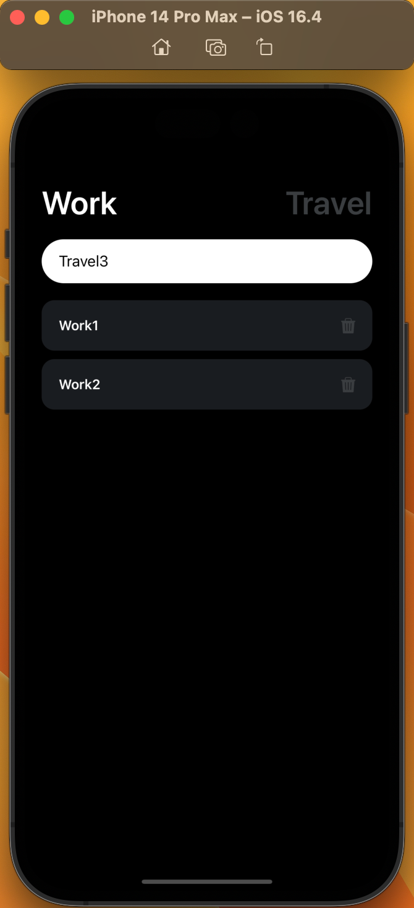
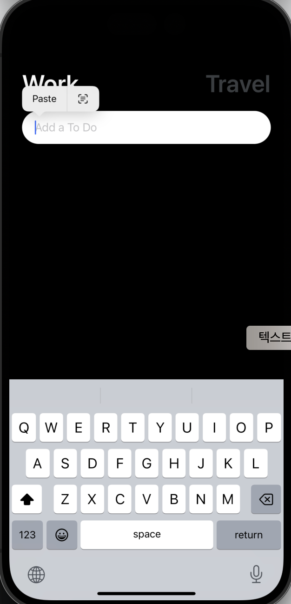

# Todo list ( Work and Travel )


투두리스트

- input
- button
- state
- data persistance


## 컴포넌트
### [TouchableOpacity](https://reactnative.dev/docs/touchableopacity) 
> 이 컴포넌트로 감싸면 클릭할 때 투명도를 줍니다.

### [TouchableHighlight](https://reactnative.dev/docs/touchablehighlight)
> 요소를 클릭하면 배경색을 바꿔줍니다.

### [TouchableWithoutFeedback](https://reactnative.dev/docs/touchablewithoutfeedback)

- one child 만 넣어야 합니다. 여러 컴포넌트를 넣고싶다면 `View` 로 감싸야 합니다.

```js
function MyComponent(props: MyComponentProps) {
  return (
    <View {...props} style={{flex: 1, backgroundColor: '#fff'}}>
      <Text>My Component</Text>
    </View>
  );
}

<TouchableWithoutFeedback onPress={() => alert('Pressed!')}>
  <MyComponent />
</TouchableWithoutFeedback>;
```
### [TextInput](https://reactnative.dev/docs/textinput)
> 텍스트 인풋 컴포넌트 <br />
> 이 컴포넌트를 누르면 키보드가 뜬다.

```js
const [working, setWorking] = useState(true);
const [text, setText] = useState('');

<TextInput
  onChangeText={onChangeText}
  value={text}
  placeholder={ 'Add a To Do' }
  style={styles.input}
/>
```



## 패키지
### AsyncStorage
https://react-native-async-storage.github.io/async-storage/docs/install/

> 데이터를 persist 할 때 사용한다.

설치
```
npm install @react-native-async-storage/async-storage
```

expo cli 로 설치 [추천, 호환성이 좋다]
```
npx expo install @react-native-async-storage/async-storage
```

#### 사용법
> Async Storage 는 브라우저의 로컬스토리지 처럼 문자열 데이터만 저장할 수 있습니다. 따라서 JSON 으로  serialize 를 우선적으로 해야 하고, JSON.parse() 메서드로 데이터를 로드 할 수 있습니다.


Importing
```js
import AsyncStorage from '@react-native-async-storage/async-storage';
```

Storing Data
```js
const storeData = async (value) => {
  try {
    const jsonValue = JSON.stringify(value);
    await AsyncStorage.setItem('my-key', jsonValue);
  } catch (e) {
    // saving error
  }
};
```

Reading Data
```js
const getData = async () => {
  try {
    const jsonValue = await AsyncStorage.getItem('my-key');
    return jsonValue != null ? JSON.parse(jsonValue) : null;
  } catch (e) {
    // error reading value
  }
};
```

## API

### Alert
https://reactnative.dev/docs/alert

> 대화창을 팝업시킨다.

예시
```js
import React from 'react';
import {View, StyleSheet, Button, Alert} from 'react-native';

const App = () => {
  const createTwoButtonAlert = () =>
    Alert.alert('Alert Title', 'My Alert Msg', [
      {
        text: 'Cancel',
        onPress: () => console.log('Cancel Pressed'),
        style: 'cancel',
      },
      {text: 'OK', onPress: () => console.log('OK Pressed')},
    ]);

  const createThreeButtonAlert = () =>
    Alert.alert('Alert Title', 'My Alert Msg', [
      {
        text: 'Ask me later',
        onPress: () => console.log('Ask me later pressed'),
      },
      {
        text: 'Cancel',
        onPress: () => console.log('Cancel Pressed'),
        style: 'cancel',
      },
      {text: 'OK', onPress: () => console.log('OK Pressed')},
    ]);

  return (
    <View style={styles.container}>
      <Button title={'2-Button Alert'} onPress={createTwoButtonAlert} />
      <Button title={'3-Button Alert'} onPress={createThreeButtonAlert} />
    </View>
  );
};

const styles = StyleSheet.create({
  container: {
    flex: 1,
    justifyContent: 'space-around',
    alignItems: 'center',
  },
});

export default App;
```

1. import 문: 코드의 상단에 있는 import 문은 사용할 모듈을 가져옵니다. React는 React 컴포넌트를 작성하기 위해 사용되며, View, StyleSheet, Button, Alert는 React Native의 내장 컴포넌트 및 API입니다.
2. createTwoButtonAlert 함수: Alert.alert 함수를 사용하여 두 개의 버튼이 있는 알림창을 생성하는 함수입니다. 'Alert Title'은 알림창의 제목, 'My Alert Msg'는 알림창에 표시될 메시지입니다. 버튼에는 'Cancel'과 'OK'라는 텍스트가 있으며, 각각의 버튼을 누를 때마다 콘솔에 메시지가 출력됩니다.
3. createThreeButtonAlert 함수: createTwoButtonAlert와 비슷하게 작동하지만, 여기서는 세 개의 버튼이 있는 알림창을 생성합니다. 버튼에는 'Ask me later', 'Cancel', 'OK'라는 텍스트가 있으며, 각각의 버튼을 누를 때마다 콘솔에 메시지가 출력됩니다.

이 코드는 간단한 레이아웃과 알림창을 구현하는 React Native 앱의 예시입니다. 버튼을 누르면 알림창이 표시되고, 각 버튼에 대한 동작을 설정할 수 있습니다.